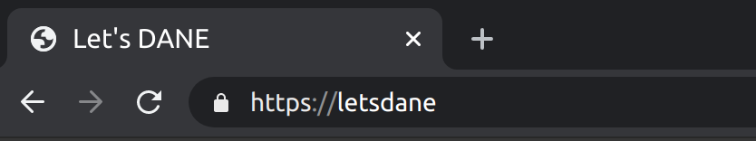

# Let's DANE

	

**Note: Let's DANE is still under development, use at your own risk.**
 

Let's DANE enables the use of [DANE (DNS Based Authentication of Named Entities)](https://tools.ietf.org/html/rfc6698) in browsers and other apps using a lightweight proxy. It currently supports DANE-EE and works with self-signed certificates.

 
 

This domain is DNSSEC signed with <a href="https://ed25519.nl/">ed25519</a> on a decentralized name and CA, handshake.org.   
  

 

torproject.org with DANE-EE validated certificate
 

## How it works

Let's DANE acts as a trusted intermediary between the browser and DANE enabled sites. It will check if a domain supports it, and generate a certificate on the fly if the authentication was successful. The connection will remain encrypted between you and the end server. If a website doesn't support DANE, its original certificate will be served instead.

You are essentially trusting your own private certificate authority. You can install it in your browser's CA store to issue certificates for successful DANE authentications.

## Features
- [x] Full DANE-EE support including self-signed certificates ([RFC6698](https://tools.ietf.org/html/rfc6698), [RFC7671](https://tools.ietf.org/html/rfc7671))
- [x] Client-side DNSSEC validation using libunbound
- [x] Prevents downgrade attacks to traditional CAs 
- [x] Lightweight DANE tunnels that work with most protocols and with ALPN support.
- [ ] Happy Eyeballs v2 ([RFC8305](https://tools.ietf.org/html/rfc8305))

## Build from source

You can build the latest version from source for now. binaries in releases are not up to date yet.

Go 1.15+ is required. If you compile with unbound, make sure you have libunbound installed.

    git clone https://github.com/buffrr/letsdane.git && cd letsdane/cmd/letsdane
    go build -tags unbound

Note: If you have a client-side dnssec validating resolver, you can build without unbound, by removing `-tags unbound` and run letsdane with `-skip-dnssec`
(letsdane will only check the Authenticated Data flag set by your resolver so you need to make sure it's set up correctly)

## Quick Usage

Let's DANE will generate a CA and store it in `~/.letsdane` when you start it for the first time. 
To start the proxy server:

    ./letsdane

    
* Add Let's DANE proxy to your web browser `127.0.0.1:8080`

* Import the certificate file into your browser certificate store. You can use `letsdane -o myca.crt` to export the public cert file to a convenient location.

By default, letsdane will use the system resolver settings from `/etc/resolv.conf` and fallback to root hints. 
All queries are DNSSEC validated with a hardcoded ICANN 2017 KSK (you can set trust anchor file by setting `-anchor` option)

Use `letsdane -help` to see command line options. 

## Let's DANE with Handshake

You can use [hsd](https://github.com/handshake-org/hsd) or [hnsd](https://github.com/handshake-org/hnsd). Specify address:port of the handshake resolver. You must have it local on your machine or use sig0. 

Optionally use `-skip-icann` to skip TLSA lookups for ICANN tlds and prevent the generated CA from issuing certificates for ICANN tlds (recommended hnsd is still experimental and also this will not break some legacy domains using poorly configured nameservers). 

Assuming hnsd is listening on '127.0.0.1:8585'

    ./letsdane -r 127.0.0.1:8585 -skip-dnssec -skip-icann

If you use hsd, you can optionally use sig0 by specifying the public key `public_key@ip:port`

    ./letsdane -r aj7bjss4ae6hd3kdxzl4f6klirzla377uifxu5mnzczzk2v7p76ek@192.168.1.22:8585 -skip-icann

Firefox creates a separate CA store for each profile, so it's recommended to use that if you want the CA to only be trusted by a specific profile.
#### DANE-EE Sites
 
* FreeBSD: https://freebsd.org
* Tor Project: https://torproject.org

handshake

* https://letsdane
* https://proofofconcept
* https://humbly

## Threat Model
The proxy is intended to be installed locally on your machine, and the generated CA should only be used on that machine. letsdane assumes that your user account is secure (even without letsdane, your user account must not be compromised to be able to use a browser securely) 

## Use of resolvers

letsdane uses libunbound to validate DNSSEC, so you don't need to trust any dns provider. 
If you already have a local DNSSEC capable resolver, and you don't want letsdane to validate dnssec for you, 
you can use `-skip-dnssec`  (you should know what you're doing because this can be dangerous!)

If you use `-skip-dnssec`, letsdane will use the Authenticated Data flag.

## Why?

I wanted to try DANE, but no browser currently supports it. It may still be a long way to go for browser support, but if you want to try it now you can!

## Contributing
Contributions are welcome! 

## Credits

Thanks to the awesome [miekg/dns](https://github.com/miekg/dns) package.

Even though TLS proxies are not new, the [GNU Naming System](https://gnunet.org/en/gns.html) has prior art on this since they also use a TLS proxy to make their domains work in other applications, but their naming system is very different from traditional DNS.

