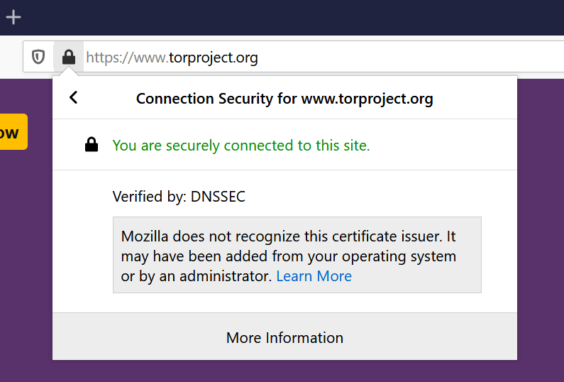

# Go DANE

**Note: Go DANE is still under development, use at your own risk.**

Go DANE enables the use of DANE/TLSA in browsers using a simple proxy. It currently supports [DANE](https://tools.ietf.org/html/rfc6698) EE(3), and works with self-signed certificates.

 

## How it works

Go DANE mitms HTTPS for sites that support DANE.  It requires one root CA to be installed locally. Go DANE will use the root CA to create certificates on the fly if it was able to verify DANE/TLSA.
It won't mitm sites that don't use DANE/TLSA and will serve their original certificate instead.
 

## Usage

Download the latest pre-built binary for your OS from [releases](https://github.com/buffrr/godane/releases) and run

    ./godane -dns tls://1.1.1.1
    
* Add Go DANE proxy to your web browser `127.0.0.1:8080` (see [Firefox instructions](doc/firefox.md)). Make sure to add it for HTTPS as well. 

* Visit `http://godane.test` and click install certificate.

Note: When you run Go DANE for the first time, it will generate a root CA and store it in `~/.godane`.
The easiest way to try it out is to use Firefox because it supports adding a proxy natively and has a built in CA store so that you don't have to add the root CA or proxy to your whole OS (it's still experimental). 

#### Some sites that currently use DANE-EE(3):
* FreeBSD: https://freebsd.org

* Tor Project: https://torproject.org

* Kumari https://www.kumari.net/

and more?

### Go DANE with handshake.org

If you're running a local hsd node listening for dns queries:

    ./godane -dns udp://:53

You can also use [easyhandshake](https://easyhandshake.com) resolver.

    ./godane -dns https://easyhandshake.com:8053
    
    
Note: You can configure hsd to use a different port if 53 is in use.

## Use of resolvers

Go DANE doesn't perform DNSSEC verficiation by itself. The resolver you specify must be DNSSEC capable. If you have a local resolver that is DNSSEC capable, you can use udp or tcp. If not, please use a trusted resolver that supports DNSSEC and uses DOT or DOH.

Note: Go DANE will ignore TLSA responses that don't come with the [Authenticaed Data (AD)](https://tools.ietf.org/html/rfc3655) flag.

## Why?

I wanted to use DANE/TLSA, but no browser currently supports it. Also, it appears that it's [not possible](https://www.dnssec-validator.cz/) to support it via an extension. So this seemed like a fun idea to try, and with [martian](https://github.com/google/martian), it was pretty easy.

 
## Contributing

Contributions are welcome! 

