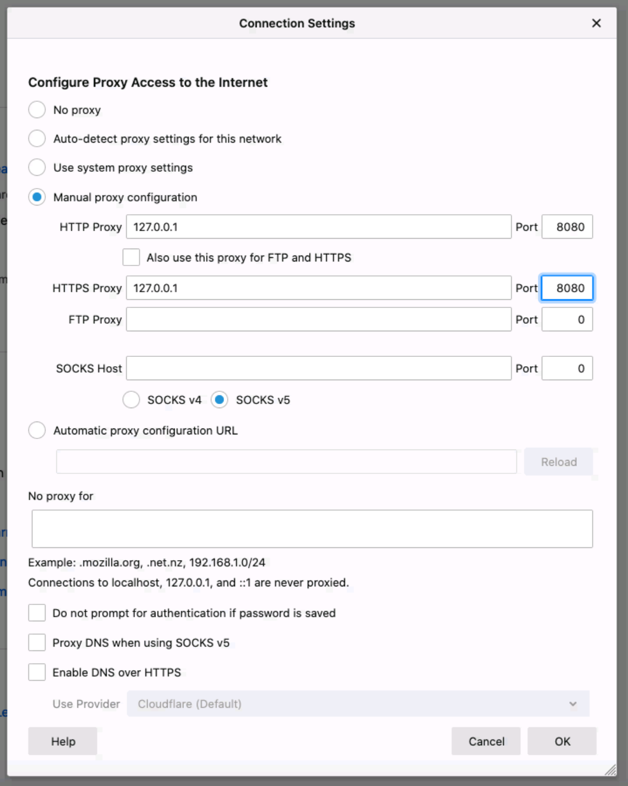
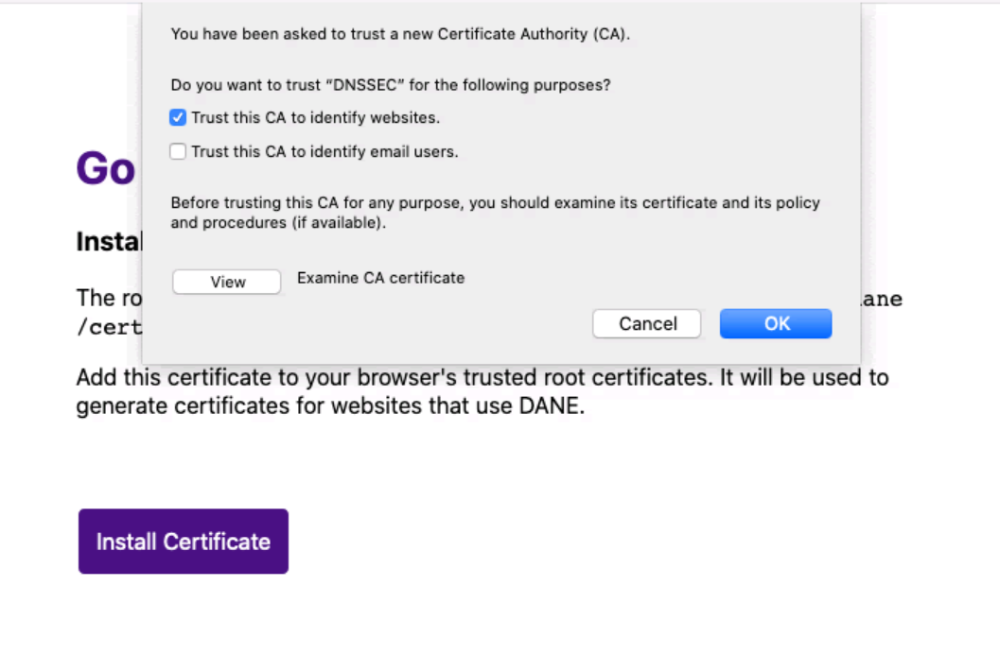

# Use Go DANE with Firefox

Go to Preferences -> Network Settings

Add the proxy for http and https. Click ok.

Visit `http://godane.test` and click install certificate.

That's it. You can now visit sites that use DANE.